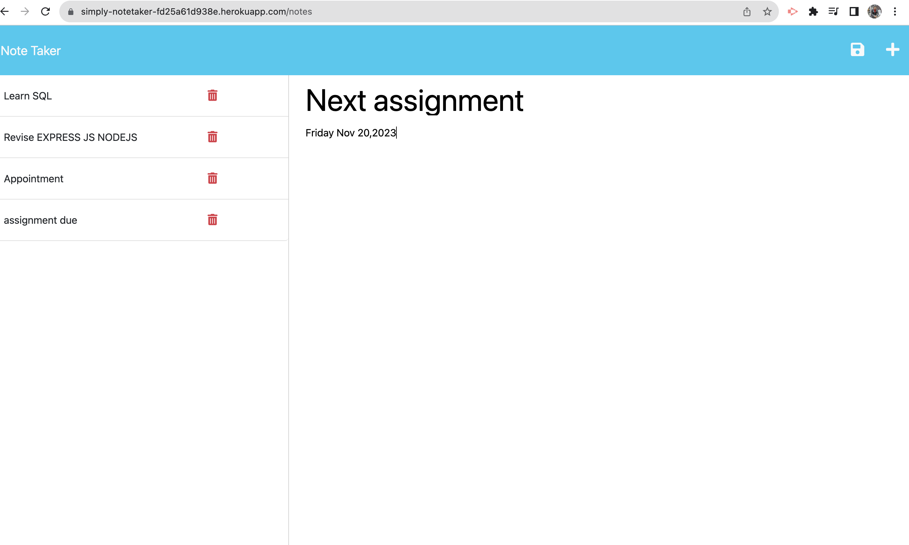
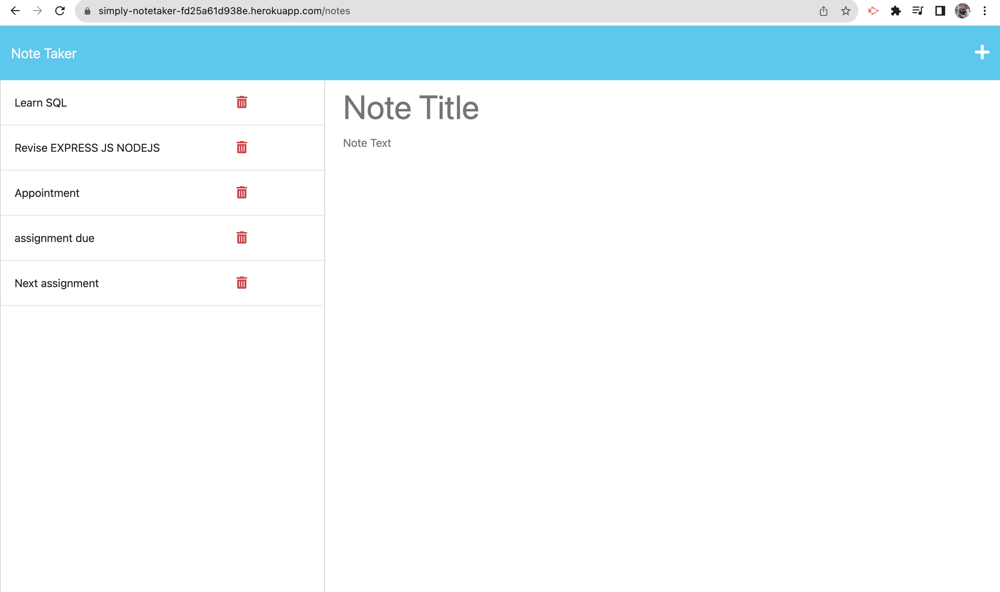

  
  # Title
 SIMPLY-NOTES
  
  ## Description
 This is dynamic web application that allows user to quickly note down the task/appointment or any notes for future reference.
 User through this application can create, add and remove notes.This application uses Express.js backend framework of Nodejs which saves data in json file.

  
  ## Table of Contents
  
  - [Installation](#Installation)
  - [Usage](#usage)
  - [Features](#features)
  - [Links](#links)
  - [credits](#credits)
  - [License](#license)
  
  ## Installation
  To ensure the application runs successfully in your local machine, you need to follow following guidelines:
  - Clone the repository to your local machine
  - Install NodeJS and npm installed on the machine
  - Install Express.js and dependencies nodemon 
  - Be in the right directory and run command "npm run devStart" to run the server
  - Navigate the application

  ## Usage
   To use this NoteTaker Application:
  1. Open the application in the browser through the link attached below(heroku link)
  2. You are presented with front section of the application with "Get started."
  3. Right section ,you can add the title and text along with save button to save your notes
  4. The saved notes will be displayed in left section
  5. Delete the notes with delete button icon.

  ## Features
  - Realtime saving of notes 
  - User friendly interface
  - Simple functionality for saving, deleting and adding notes
  - Unique ID to each note to manage the notes

  ## links
  -  Link of my [Github repository](https://github.com/Sabinkthapa/NoteTaker.git)
  -  Link of apps in [Heroku](https://simply-notetaker-fd25a61d938e.herokuapp.com/)
  - working app image-1 
  - working app image-2 
  

  ## Credits
  - Link of Documentation [Expressjs](https://expressjs.com/)
  - Link of Dependency [nodemon](https://www.npmjs.com/package/nodemon)
  - link of [Heroku] (https://devcenter.heroku.com/articles/getting-started-with-nodejs#set-up)
  - Link of UNB course section [Unb course section](https://courses.bootcampspot.com)

  ## License
   All resources provided by this project are available for free use and distribution,subject to the term of Apache license.
                                      (c)Copyright 2023 Sabin